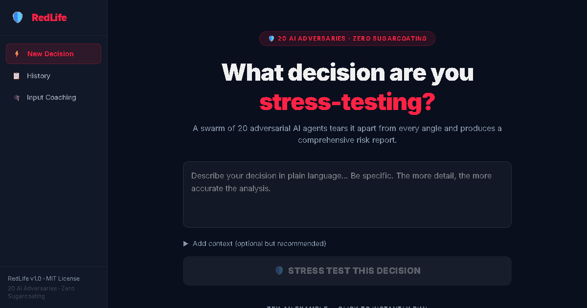

# 🛡️ RedLife: The AI Decision Stress-Testing Engine

> Optimism kills. Let 100 to 1,000+ dynamically generated adversarial LLM psychological profiles meticulously tear your life decisions apart *before* you make them.



## 🤯 What is RedLife?

When you make a big life choice—quitting a job, moving to a new city, starting a startup—your brain is biologically hardwired for **Optimism Bias**. You see the best-case scenario and ignore the blind spots.

**RedLife is the antidote.** 

It is an autonomous multi-agent simulation where **hundreds to thousands of specialized, unhinged AI adversaries** cross-examine your decision. They calculate runway, map dependency failures, and ruthlessly exploit your emotional blind spots to generate a forensic **Pre-Mortem**: a story of exactly how your decision is going to fail.

### The 3-Round Simulation:
1. **Adversarial Critiques:** All agents independently attack the decision in parallel waves from their unique lens (e.g., *The Financial Reaper* models your cash burn; *The Time Thief* calculates opportunity cost).
2. **Cross-Debate:** The agents challenge *each other*. If one agent is too optimistic, the *Devil's Advocate* or *Doomsday Prepper* will step in and escalate the risk vertically.
3. **Forensic Synthesis:** The engine extracts hyper-specific "Hidden Opportunities," calculates an overall Risk Priority Number (RPN) matrix, and writes a literal NEWS ARTICLE about your future failure.

---

## 🚀 Quick Start (Local Setup)

RedLife supports two simulation modes:
1.  **Instant / Lite (Default):** Runs 20 adversarial agents entirely in your browser. No backend or API keys required. Just clone and run the frontend.
2.  **Scalable / Brutal (Backend):** Scales to 100-1,000+ agents using the Python FastAPI engine. Requires an LLM provider (Ollama or OpenAI/Anthropic).

### ⚡ Mode 1: Instant Browser Simulation (Zero Setup)
```bash
cd frontend
npm install
npm run dev
```
Open **http://localhost:5173** and start testing immediately.

### 🧠 Mode 2: Scalable Backend Engine (100+ Agents)
1.  **Backend Setup:**
    ```bash
    cd backend
    pip install -r requirements.txt
    cp .env.example .env # Add your OPENAI_API_KEY or use local Ollama
    uvicorn main:app --port 8002 --reload
    ```
2.  **Frontend Setup:**
    Ensure the backend is running, then start the frontend:
    ```bash
    cd frontend
    npm run dev
    ```

**⚠️ PRO TIP for Mode 2:**
For the most "viral" and psychologically brutal critiques, we recommend using `gpt-4o` or `claude-3-5-sonnet`. You can configure these in your `.env`. (Local Ollama models like `llama3.1` work great for privacy but may be less aggressive).


---

## 🧠 Meet The Adversaries (A Selection)

Your decision is fed to a procedurally generated pool of 100-1000+ distinct profiles drawn from 10 Core Archetype Families. A few of the heavy hitters include:

*   💀 **The Financial Reaper:** Calculates the exact month your runway hits zero. Cites bankruptcy logic.
*   💔 **The Relationship Saboteur:** Speaks for your dependents. Gives voice to the silent resentment building in your partner.
*   ⏳ **The Time Thief:** Models opportunity cost. Tells you exactly what you're sacrificing by choosing this specific path.
*   🔥 **The Burnout Prophet:** Maps your motivation curve. Predicts the exact week your adrenaline will fail and you'll want to quit.

---

## 🎓 Input Coaching (How to maximize accuracy)
RedLife is only as ruthless as the data you feed it. 
*   ❌ **Weak Input (40% accuracy):** "I want to start a bakery."
*   ✅ **Surgical Input (98% accuracy):** "I'm quitting my $100k job in 2 months to start a bakery. I have $40k savings, a working spouse, and my biggest fear is running out of money before month 8. Success is $10k MRR in Year 1."

---

## 🛠 Tech Stack
*   **Backend:** FastAPI, Pydantic, SQLAlchemy (SQLite), SSE-Starlette, Asyncio Semaphores
*   **Frontend:** React 19, Vite, TailwindCSS v4, Zustand, Axios, Framer Motion
*   **AI Engine:** Agnostic JSON-parsing LLM Abstraction (OpenAI, Anthropic, Ollama local)

## 📄 License
MIT License - Don't blame us if the AI tells you the hard truth and you change your life trajectory.
